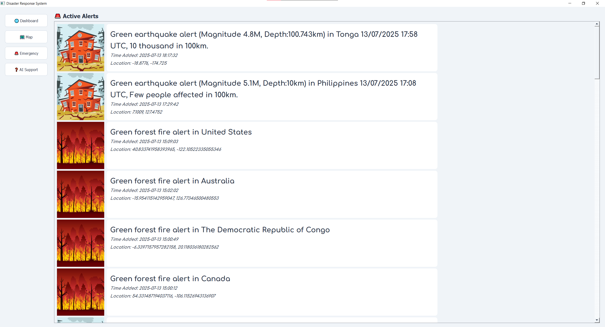
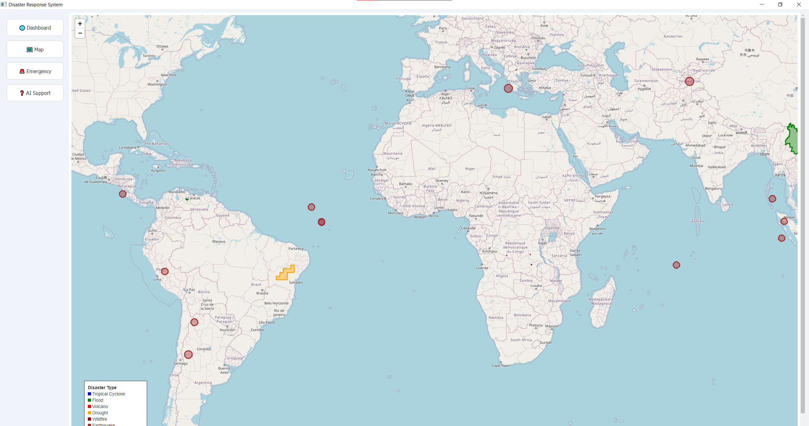

# Disaster-Software
A Python Software made to condense disaster data for emergency services to use.

## Images
 
 
 

---

## How It Works

**Tech used:** Python, PyQt5 & PyQtWebEngine, Folium, Playwright, Google Generative AI, Requests

* **GDACS** – multithreaded fetcher pulls the latest *Global Disaster Alert & Coordination System* events, then normalises them into a JSON list
* **Interactive map** – Folium draws colour-coded polygons / rectangles for each event
* **UI** – PyQt for **Dashboard**, **Map**, **Emergency Contacts** and **AI Support** pages
* **AI Support** – Gemini LLM synthesises evacuation plans, while Playwright scrapes real-time Google News + Threads chatter for extra context 

---

## Features

* **Dashboard cards** – headline, severity badge & time-ago for each live alert
* **Risk map** – Active polygons showing events
* **Global 911** – pick any country and instantly get ambulance / fire / police numbers
* **Gemini plans** – click an alert to get condensed information on any disaster and plans generated to help the responder

---

## Lessons Learned 

* Learned how to make a python software using PyQt
* Using Gemini or other AI APIs for projects
* Scrapping data from the web and the challenges and ethics behind it

---

## Getting Started Locally 🏃‍♂️

```bash
# 1) Clone
git clone https://github.com/Umar-Ansari-X/Disaster-Software.git
cd Disaster-Software

# 2) Python deps
pip install -r requirements.txt 

# 3) Run the app
python main.py
